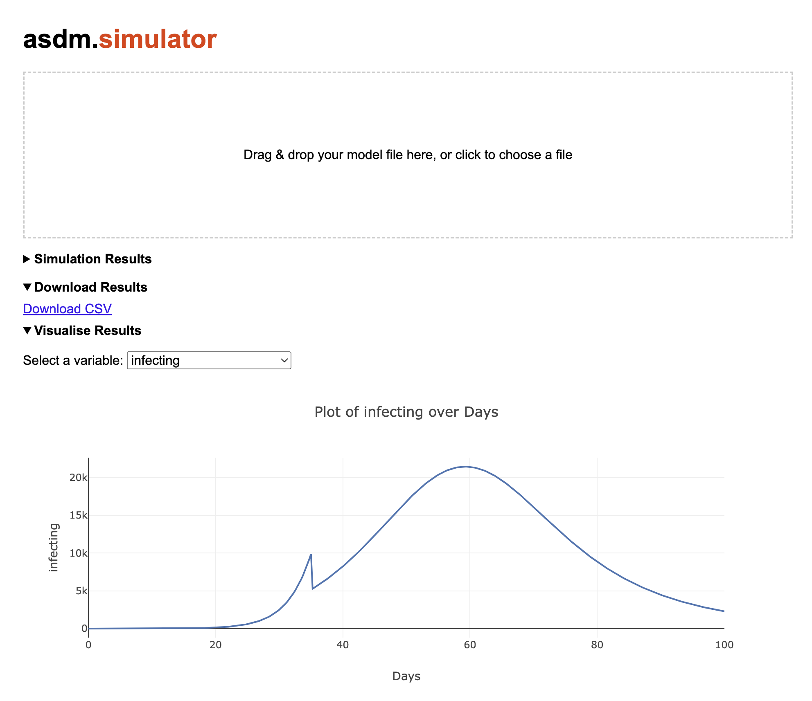

# asdm

## **Agile System Dynamics Modelling**

ASDM is a Python library that enables users to create and simulate System Dynamics (SD) models. It also supports SD models saved in the XMILE format, including advanced features such as arrays and conveyors. The support is being continuously improved.

### **ASDM's Contribution & Impact**

Check out this presentation: [Project Care Home Demand](https://www.youtube.com/watch?v=tP1X38h8Ks4), given by **Sally Thompson**, Senior Healthcare Analyst at *The Strategy Unit* (part of NHS Midlands and Lancashire CSU). The presentation [highlights](https://www.youtube.com/watch?v=tP1X38h8Ks4&t=492s) the role of ASDM in developing an [**online SD model-based simulator**](https://connect.strategyunitwm.nhs.uk/care-home-demand/).


### **Library Structure**
- `asdm/asdm.py` contains the main functionalities, including the lexer, parser, and interpreter.
- `asdm/utilities.py` provides a data visualisation tool.
- `asdm/inference/` consists of tools for model calibration.
- `asdm/simulator/` provides a **web-based simulation interface** for easy model execution, result downloading, and visualisation.

---
## **Installation**
### **Install from PyPi**
```sh
pip install asdm
```
ASDM and its required dependencies will be automatically installed.

---

## **Basic Usage**
To create a new SD model using ASDM:
```python
from asdm import sdmodel

model = sdmodel()
```
`sdmodel` is the core class for System Dynamics models.

Alternatively, you can load an SD model saved in XMILE format, including `.stmx` models:
```python
model = sdmodel(from_xmile='example_model.stmx')
```

Run the simulation:
```python
model.simulate()
```

Export simulation results:
- As a **pandas DataFrame**:
  ```python
  result = model.export_simulation_result(format='df')
  ```
- As a **Python dictionary**:
  ```python
  result = model.export_simulation_result(format='dict')
  ```

---

## **Web-Based Simulation Interface**
ASDM now includes a **web-based simulation interface** that allows users to:
- Upload `.stmx` or `.xmile` models for simulation.  
- Download simulation results as a **CSV file**.  
- Select variables and visualise them on an **interactive chart**.  



### **Quick Start**
Run the ASDM web simulator with:
```sh
asdm.simulator
```
By default, this starts a local server at `http://127.0.0.1:8080`. If port 8080 is unavailable, specify a different port, for example:
```sh
asdm.simulator --port 8081
```
You can also bind to all network interfaces to allow access from others:
```sh
asdm.simulator --host 0.0.0.0
```
Once started, the browser will automatically open the simulator page.

### **Features**
- **Drag-and-drop file upload**: Upload your `.stmx` or `.xmile` model file.
- **Simulation results in a table**: Automatically display after the model runs.
- **CSV download**: You can download simulation results as a CSV file.
- **Interactive charting**:
  - Select variables from a dropdown list.
  - Automatically detects the **time column name** (e.g., "Years", "Months", etc.).
  - Uses **Plotly.js** to generate interactive line charts.

---

## **Functionalities**
Please refer to [Documentation](Documentation.md) for detailed function descriptions.

---

## **Tutorial Jupyter Notebooks**
Jupyter Notebooks demonstrate ASDM's functionalities:

### **[SD Modelling](demo/Demo_SD_modelling.ipynb)**
- Creating an SD model from scratch:
  - Adding **stocks, flows, auxiliaries**.
  - Support for **nonlinear** and **stochastic** functions.
- Running simulations.
- Exporting and examining simulation results.
- Visualising results.

### **[Support for .stmx Models](demo/Demo_stmx_support.ipynb)**
- Load and simulate `.stmx` models.
- Support for **arrays**.
- Modify equations and re-run simulations.

More tutorial notebooks will be added.  
Feel free to contribute your own via **pull requests**—please ensure they do not contain sensitive data.

---

## **Licence**
ASDM is open-source and released under the **MIT licence**.

---

## **Contributors**
### **Wang Zhao** (`main author`)
- Postgraduate research student & research assistant at **University of Strathclyde, UK**.
- Software engineer at **Newcastle Marine Services, UK**.
- Speaker at multiple conferences on SD modelling.
- Contact: [wang.zhao@strath.ac.uk](mailto:wang.zhao@strath.ac.uk); [wzh1895@outlook.com](mailto:wzh1895@outlook.com)
- Conference talk: [Watch Here on YouTube](https://www.youtube.com/watch?v=I_0YpIKc3yI&t=2321s).

### **Matt Stammers** (`contributor`)
- Consultant Gastroenterologist & open-source developer at **University Hospital Southampton, UK**.
- Developed **Streamlit-powered web apps** using ASDM for healthcare modelling.
- Part of the **Really Useful Models** initiative: [Learn More](https://opendatasaveslives.org/news/2022-01-05-really-useful-models).
- GitHub: [Matt's Homepage](https://github.com/MattStammers).

---
