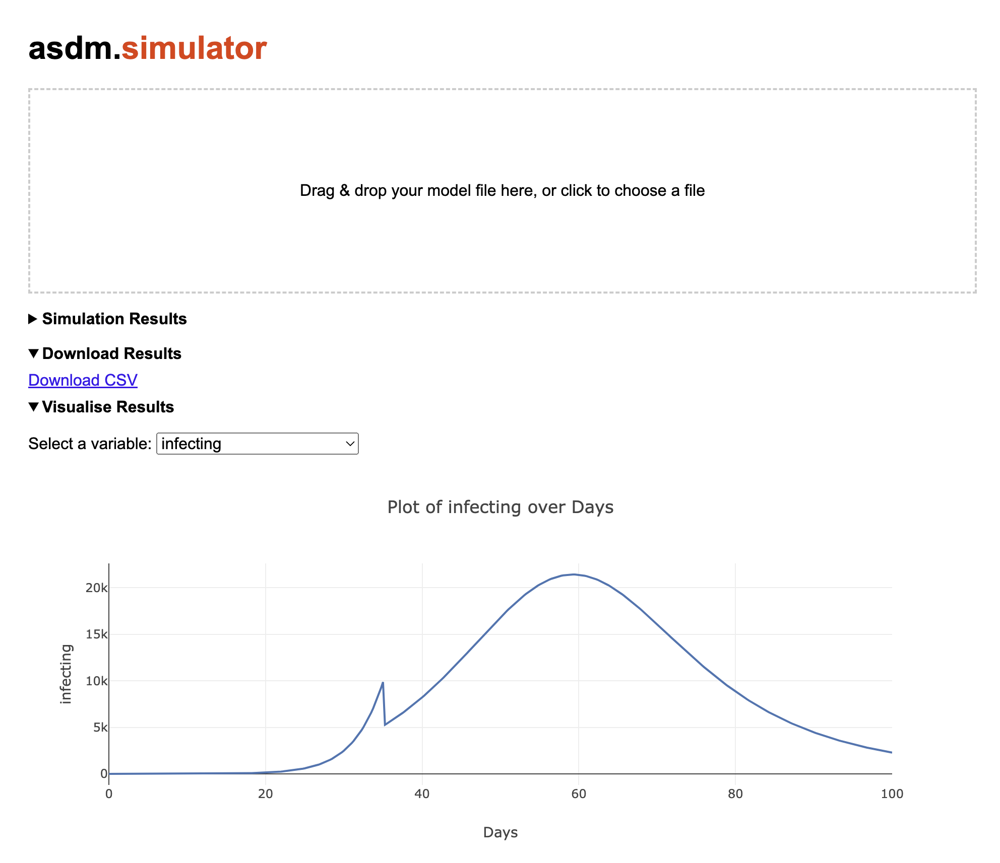

# asdm

## **Agile System Dynamics Modelling**

ASDM is a Python library for building and simulating [System Dynamics](https://en.wikipedia.org/wiki/System_dynamics) (SD) models. It supports programmatic model creation, XMILE/`.stmx` import and export, and includes a built-in web simulator. ASDM is suitable for healthcare modelling, policy analysis, and any domain where stock-and-flow models are used.

### **Key Features**

- **Programmatic model building** — create stocks, flows, auxiliaries, and delayed auxiliaries from Python code.
- **XMILE round-trip** — load `.stmx`/`.xmile` models, modify them, and save back to XMILE format.
- **Arrays and subscripts** — multi-dimensional variables with element-level or parallel equations.
- **Conveyors** — conveyor stocks with transit time and leak flows.
- **Graph functions** — lookup tables with interpolation, modifiable at runtime.
- **Data import** — feed time-varying or parameter data from CSV files into model variables.
- **Built-in SD functions** — `DELAY`, `DELAY1`, `DELAY3`, `SMTH1`, `SMTH3`, `PULSE`, `STEP`, `INIT`, `HISTORY`, `NORMAL`, `BINOMIAL`, `LOOKUP`, and more.
- **Causal Loop Diagrams** — generate CLDs from model structure using NetworkX.
- **Web simulator** — browser-based interactive simulator with charts and CSV export.
- **Command-line interface** — run simulations and export results from the terminal.

### **ASDM's Contribution & Impact**

Check out this presentation: [Project Care Home Demand](https://www.youtube.com/watch?v=tP1X38h8Ks4), which [highlights](https://www.youtube.com/watch?v=tP1X38h8Ks4&t=492s) the role of ASDM in developing an [online SD model-based simulator](https://connect.strategyunitwm.nhs.uk/care-home-demand/). The presentation is given by **Sally Thompson**, Senior Healthcare Analyst at The Strategy Unit (part of NHS Midlands and Lancashire CSU).

---
## **Installation**
### **Install from PyPi**

Requires **Python 3.9** or later.

```sh
pip install asdm
```
ASDM and its required dependencies will be automatically installed.

---

## **Basic Usage**
To create a new SD model using ASDM:
```python
from asdm import sdmodel

model = sdmodel()
```
`sdmodel` is the core class for System Dynamics models.

Alternatively, you can load an SD model saved in XMILE format, including `.stmx` models:
```python
model = sdmodel(from_xmile='example_model.stmx')
```

Run the simulation:
```python
model.simulate()
```

Export simulation results:
- As a **pandas DataFrame**:
  ```python
  result = model.export_simulation_result(format='df')
  ```
- As a **Python dictionary**:
  ```python
  result = model.export_simulation_result(format='dict')
  ```

Save the model back to XMILE format:
```python
model.save_xmile('output_model.stmx')
```

---

## **Running Simulations**

Beyond the Python API, ASDM provides two ways to run simulations without writing code:

### **Web Interface**
Perfect for exploring models, visualizing results, and quick iterations.

**Launch the simulator:**
```sh
asdm simulator
```
Opens in your browser at `http://127.0.0.1:8080`. 

**Run a specific model immediately:**
```sh
asdm simulator model.stmx
```

**Options:**
- `--port 8081` — Use a different port
- `--host 0.0.0.0` — Allow access from other machines

**Features:**
- Drag-and-drop model upload (`.stmx`, `.xmile`)
- Interactive charts with variable selection
- Download results as CSV
- Auto-detects time units



---

### **Command Line**
Ideal for batch processing, automation, and integrating into pipelines.

**Run a simulation:**
```sh
asdm run model.stmx
```
Results saved as `model.csv` by default.

**Custom output:**
```sh
asdm run model.stmx --output results.csv
```

**Use in scripts:**
```sh
# Process multiple models
for model in models/*.stmx; do
  asdm run "$model" --output "results/$(basename $model .stmx).csv"
done
```

**Check version:**
```sh
asdm --version
```

---

## **Functionalities**
Please refer to [Documentation](Documentation.md) for detailed function descriptions.

---

## **Tutorial Jupyter Notebooks**
Jupyter Notebooks demonstrate ASDM's functionalities:

### **[SD Modelling](demo/Demo_SD_modelling.ipynb)**
- Creating an SD model from scratch:
  - Adding **stocks, flows, auxiliaries**.
  - Support for **nonlinear** and **stochastic** functions.
- Running simulations.
- Exporting and examining simulation results.
- Visualising results.

### **[Support for .stmx Models](demo/Demo_stmx_support.ipynb)**
- Load and simulate `.stmx` models.
- Support for **arrays**.
- Modify equations and re-run simulations.

### **[Abstract Syntax Tree (AST)](demo/Demo_AST.ipynb)**
- How ASDM parses model equations into AST structures.

More tutorial notebooks will be added.  
Feel free to contribute your own via **pull requests**—please ensure they do not contain sensitive data.

---

## **Dependencies**

ASDM relies on the following open-source packages. All use permissive licences compatible with the MIT licence.

| Package | Licence | Purpose |
|---|---|---|
| [NumPy](https://numpy.org/) | BSD-3-Clause | Numerical computation |
| [pandas](https://pandas.pydata.org/) | BSD-3-Clause | Data export and CSV handling |
| [Matplotlib](https://matplotlib.org/) | PSF-based (BSD-compatible) | Result visualisation |
| [NetworkX](https://networkx.org/) | BSD-3-Clause | Dependency graphs and CLDs |
| [lxml](https://lxml.de/) | BSD-3-Clause | XML processing |
| [Beautiful Soup 4](https://www.crummy.com/software/BeautifulSoup/) | MIT | XMILE parsing |
| [SciPy](https://scipy.org/) | BSD-3-Clause | Scientific functions |
| [Flask](https://flask.palletsprojects.com/) | BSD-3-Clause | Web simulator |

---

## **Licence**
ASDM is open-source and released under the **MIT licence**.

---

## **Contributors**
### **Wang Zhao** (`main author`)
- Scientific Collaborator at **Swiss Tropical and Public Health Institute, Switzerland**.
- Contact: [wang.zhao@swisstph.ch](mailto:wang.zhao@swisstph.ch)

### **Matt Stammers** (`contributor`)
- Consultant Gastroenterologist & open-source developer at **University Hospital Southampton, UK**.
- Developed **Streamlit-powered web apps** using ASDM for healthcare modelling.
- Part of the **Really Useful Models** initiative: [Learn More](https://opendatasaveslives.org/news/2022-01-05-really-useful-models).
- GitHub: [Matt's Homepage](https://github.com/MattStammers).

---
